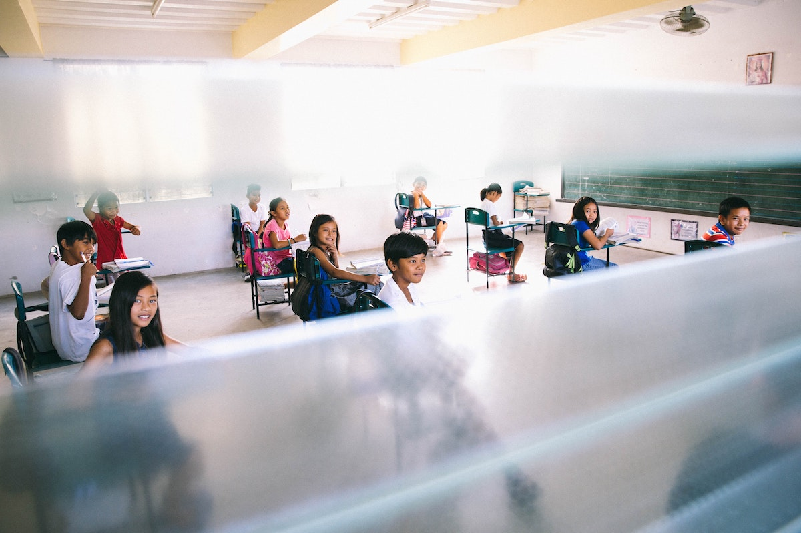
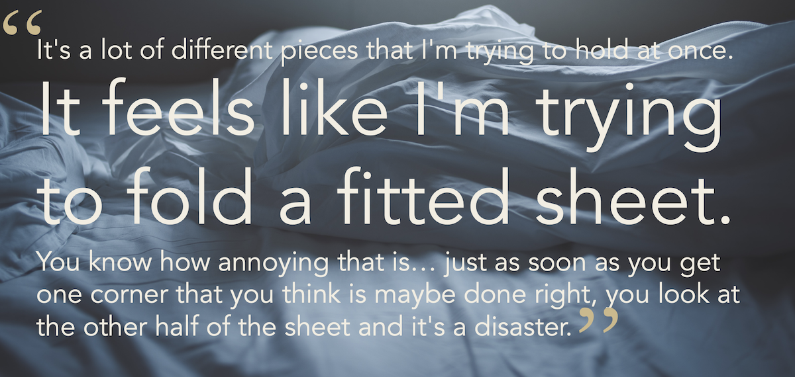
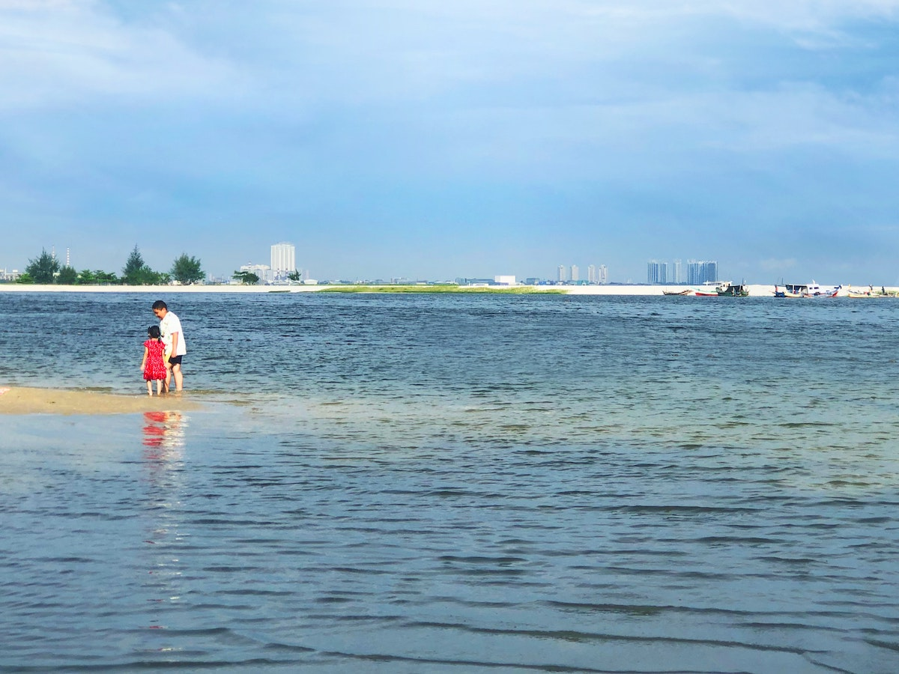

```{r setup, include=FALSE}
usethis::use_git_ignore(c("*.csv", "*.rds"))
options(htmltools.dir.version = FALSE)

library(knitr)
library(tidyverse)
library(xaringan)
library(fontawesome)
```

class: inverse, center, middle

# `r fa("fas fa-images", fill = "#fff")`

**View the slides:** 

[bretsw.com/aera23-teachers-social-media](https://bretsw.com/aera23-teachers-social-media/)

---

class: inverse, center, middle

# `r fa("far fa-compass", fill = "#fff")` <br><br> Background

---

# `r fa("far fa-compass", fill = "#fff")` Beginning Teachers

```{r, out.width = "680px", echo = FALSE, fig.align = "center"}

```

--

Social media offer new opportunities for beginning teachers

--

but also introduce new challenges 

---

# `r fa("far fa-compass", fill = "#fff")` Beginning Teachers

```{r, out.width = "680px", echo = FALSE, fig.align = "center"}

```

--

Beginning teachers must juggle more outlets 

--

and potentially competing voices for professional learning

---

class: inverse, center, middle

# `r fa("fas fa-arrows-left-right-to-line", fill = "#fff")` <br><br> Gap

---

# `r fa("fas fa-arrows-left-right-to-line", fill = "#fff")` Gap

```{r, out.width = "680px", echo = FALSE, fig.align = "center"}

```

--

Unclear how professional learning through social media 

--

impacts instructional practice

---

class: inverse, center, middle

# `r fa("fas fa-share-nodes", fill = "#fff")` <br><br> Framework

---

# `r fa("fas fa-share-nodes", fill = "#fff")` Framework

```{r, out.width = "680px", echo = FALSE, fig.align = "center"}
include_graphics("img/frame.jpg")
```

**Professional Learning Networks:**

--

Resources + People + Spaces

---

# `r fa("fas fa-share-nodes", fill = "#fff")` Framework

```{r, out.width = "680px", echo = FALSE, fig.align = "center"}
include_graphics("img/frame.jpg")
```

**Resources:**

--

knowledge, skills, teaching tools, curricular materials, and encouragement

---

# `r fa("fas fa-share-nodes", fill = "#fff")` Framework

```{r, out.width = "680px", echo = FALSE, fig.align = "center"}
include_graphics("img/frame.jpg")
```

**People:**

--

individuals and groups

---

# `r fa("fas fa-share-nodes", fill = "#fff")` Framework

```{r, out.width = "680px", echo = FALSE, fig.align = "center"}
include_graphics("img/frame.jpg")
```

**Spaces:**

--

online and offline

---

class: inverse, center, middle

# `r fa("fas fa-screwdriver-wrench", fill = "#fff")` <br><br> Method

---

# `r fa("fas fa-screwdriver-wrench", fill = "#fff")` Method

```{r, out.width = "600px", echo = FALSE, fig.align = "center"}

```

**Design:**

--

Multiple case study

---

# `r fa("fas fa-screwdriver-wrench", fill = "#fff")` Method

```{r, out.width = "420px", echo = FALSE, fig.align = "center"}

```

**Participants:**

--

- College of Education alumni (*n* = 5)

--

- Science teachers (across middle and high school)

--

- First or second year of teaching

---

# `r fa("fas fa-screwdriver-wrench", fill = "#fff")` Method

```{r, out.width = "540px", echo = FALSE, fig.align = "center"}

```

**Data Collection:**

--

- 8 weeks of diary entries reflecting upon social media use

--

- 5 one-hour interviews with each participant

---

# `r fa("fas fa-screwdriver-wrench", fill = "#fff")` Method

```{r, out.width = "680px", echo = FALSE, fig.align = "center"}

```

**Data Analysis:**

--

- Open-ended thematic analysis of diary entries and interview transcripts

---

class: inverse, center, middle

# `r fa("fas fa-magnifying-glass", fill = "#fff")` <br><br> Results

---

# `r fa("fas fa-magnifying-glass", fill = "#fff")` Results

```{r, out.width = "680px", echo = FALSE, fig.align = "center"}
include_graphics("img/social-media.jpg")
```

**Social Media Ecosystem**

--

- Many spaces where beginning teachers are searching and following

---

# `r fa("fas fa-magnifying-glass", fill = "#fff")` Results

```{r, out.width = "680px", echo = FALSE, fig.align = "center"}

```

**Pedagogical Content Knowledge (PCK) Development**

---

# `r fa("fas fa-magnifying-glass", fill = "#fff")` Results

```{r, out.width = "540px", echo = FALSE, fig.align = "center"}

```

**Pedagogical knowledge:** *How* to teach

--

- deepening understanding

--

- practicing skills

--

- reviewing concepts

---

# `r fa("fas fa-magnifying-glass", fill = "#fff")` Results

```{r, out.width = "540px", echo = FALSE, fig.align = "center"}

```

**Content knowledge:** *What* to teach

--

- getting ideas and inspiration

--

- staying up-to-date on news and topics

--

- giving students different perspectives

---

# `r fa("fas fa-magnifying-glass", fill = "#fff")` Results

**Frustrations:**

```{r, out.width = "100%", echo = FALSE, fig.align = "center"}

```

---

# `r fa("fas fa-magnifying-glass", fill = "#fff")` Results

```{r, out.width = "600px", echo = FALSE, fig.align = "center"}

```

**Lack of depth:**

--

No evidence of sensemaking or critical thinking

---

class: inverse, center, middle

# `r fa("fas fa-person-chalkboard", fill = "#fff")` <br><br> Discussion

---

# `r fa("fas fa-person-chalkboard", fill = "#fff")` Implications

```{r, out.width = "560px", echo = FALSE, fig.align = "center"}
include_graphics("img/frame.jpg")
```

**"New" model:**

--

- Synthesized PCK model for using social media *and* adapting instructional practices

--

- Focus on self-directing the search for both **what** and **how** to teach

---

# `r fa("fas fa-person-chalkboard", fill = "#fff")` Implications

```{r, out.width = "540px", echo = FALSE, fig.align = "center"}

```

**"New" teacher knowledge and competencies:**

--

- Professional development for self-directing the search for both **what** and **how** to teach

---

# `r fa("fas fa-person-chalkboard", fill = "#fff")` Future Research

```{r, out.width = "680px", echo = FALSE, fig.align = "center"}

```

--

- Recruit larger sample

--

- Refine longitudinal design

---

class: inverse, center, middle

# `r fa("fas fa-compass", fill = "#fff")` <br><br> Conclusion

---

# `r fa("far fa-compass", fill = "#fff")` Conclusion

```{r, out.width = "600px", echo = FALSE, fig.align = "center"}

```

--

- Social media offer new opportunities for beginning teachers but also introduce new challenges

--

- Refocus efforts to support teachers as they supplement and self-direct their professional learning

---

class: inverse, center, middle

# `r fa("fas fa-question", fill = "#fff")` <br><br> Questions

**What would you like to know more about?**

<hr>

<br><br><br><br>

**Bret Staudt Willet** | Florida State University

`r fa("envelope", fill = "#fff")` [bret.staudtwillet@fsu.edu](mailto:bret.staudtwillet@fsu.edu) | `r fa("globe", fill = "#fff")` [bretsw.com](https://bretsw.com) | `r fa("fab fa-github", fill = "#fff")` [GitHub](https://github.com/bretsw/)